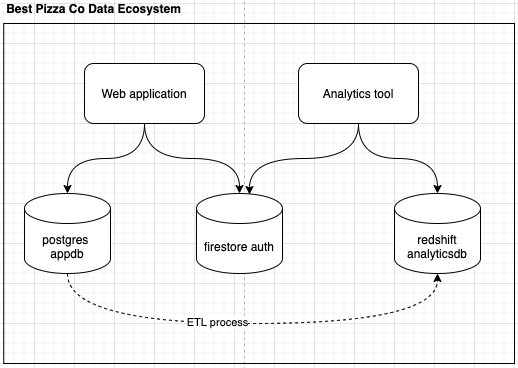

# Tutorial Overview

In this tutorial, we'll imagine that your business sells pizza online. "Best Pizza Co" has an ecommerce web application that you sell pizza through and an analytics tool that you use to maintain a constant inventory of pizzas to send and understand their buyers market. Your data ecosystem might look like this: 

When looking to expand to other international markets, you've decided to be intentional in how you scale your technology.  Using Fides, we will show you how to:

1. Declare what categories of PII you have in your 3 databases using Dataset annotations
2. Create business-function related groupings for your applications using System privacy declarations
3. Build a set of rules dictating what Best Pizza Co deems to be allowed use of PII data in your Policy

When you're done creating these Datasets, Systems, and Policy, your Fides data model might look something like this:

## Next: Taxonomy
Using these basic principles, you'll begin building a practice of data privacy awareness amongst the software teams at your company. Let's get started with the fundamentals by understanding the Fides language [Taxonomy](taxonomy.md).